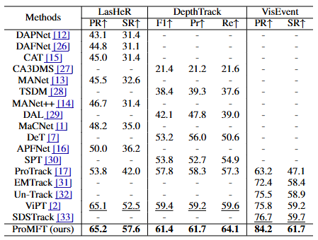
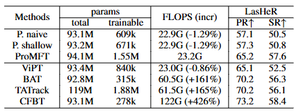

# ProMFT: An Efficient Prompt Modality Fusion Tracking Network for Multi-modal Tracking

Official implementation of ProMFT, an efficient prompt modality fusion tracking network for multi-modal tracking, including models and training&testing codes.

Models & Raw results: comming soon.

## Approach

:fire::fire::fire: ProMFT is a novel unified framework for multi-modal tracking, suits for RGB-T/D/E tracking (and potentially more). 

The architecture of ProMFT is shown below. ProMFT adopts an architecture with a single backbone and an auxiliary branch to learn modality-specific prompts.

<center></center>

The AFP module is the core of ProMFT. It generates assistive prompts to fuse auxiliary modalities. The inner detail of AFP module is shown below.

<center></center>

## Results

Results on RGB-D, RGB-T, and RGB-E tracking benchmarks.

<center></center>

With only 1.55M additional parameters, ProMFT achieves superior tracking performance on RGB-T/D/E modalities compared to both full fine-tuning methods and single-backbone prompt learning methods.

<center></center>

## Usage

### Install the environment

Create and activate a conda environment:
```
conda create -n promft python=3.12
conda activate promft
```
Install the required packages:
```
bash install_env.sh
```

### Prepare the datasets

Put the training datasets in ./datasets/.  It should look like:
```
$<ROOT_PATH>
-- datasets/
    -- depthtrack/train
        |-- adapter02_indoor
        |-- bag03_indoor
        |-- bag04_indoor
        ...
    -- LasHeR/TrainingSet/trainingset
        |-- 1boygo
        |-- 1handsth
        ...
    -- VisEvent/train
        |-- 00142_tank_outdoor2
        |-- 00143_tank_outdoor2
        ...
        |-- trainlist.txt
```

### Run training & evaluation

This repository adopts a unified entrance, `run.py`, to train and evaluate the models.

To launch training and evaluation on depthtrack benchmark with promft-deep model, for example, run:
```
python run.py configs/promft_deep_depthtrack.yml
```
This command will create a directory with timestamp in `./work_dirs/` and save the log and checkpoints.

To launch training and evaluation with multiple GPUs, apply the `--mode=parallel` option:
```
python run.py configs/promft_deep_depthtrack.yml --mode=parallel
```

If you need to resume training from a checkpoint, just use the config file in the work_dir:
```
python run.py work_dirs/20250112-093055-ProMFT-Deep_on_DepthTrack/config.yaml
```
And the checkpoint will be automatically loaded.

To train without evaluation, use the `--only-train` option:
```
python run.py configs/promft_deep_depthtrack.yml --only-train
```

To evaluate a trained model, use the `--only-test` option:
```
python run.py work_dirs/20250112-093055-ProMFT-Deep_on_DepthTrack/config.yaml --only-test
```
Note that you need to select the config file in `work_dirs/`.


## Future works on code

1. Better abstract class design for better code reusability and extensibility.
2. Compatibility with huggingface transformers, datasets, evaluate, and accelerate libraries.
3. Compatibility with vot library (TraX protocol).
4. Automatic dataset management.
5. More benchmark datasets and models.

## Acknowledgment
- This repo is based on [OSTrack](https://github.com/botaoye/OSTrack) and [ViPT](https://github.com/jiawen-zhu/ViPT), which are exellent works.

## Contact
Feel free to email zhenyinzhang22@m.fudan.edu.cn.
